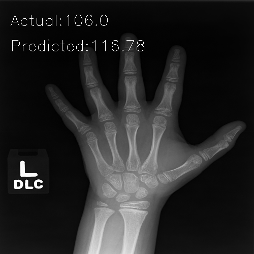

# BoneAge-Predict  

출처: https://github.com/kneehit/Bone-Age

  

입력층으로 X-Ray 사진 파일과 Gender를 받아서 뻐나이를 출력하는 네트워크  

## dataSet  
    RSNA Pediatric Bone Age Challenge를 사용  
    train set만으로 train, validation, test set을 모두 사용한다.  
    (trainset을 순서대로 배분해야 정상적으로 동작한다.)  
    # Train - 10000 images
    # Val   -  1611 images
    # Test  -  1000 images  
    
    <수정>
    실제로 나눠져 있는 train, valication, test를 넣어보고 싶어서 시도해 보았다. 
    다만 test set은 대회라서 그런지 boneage에 대한 라벨링이 되어있지 않아서  
    validation set을 2개로 나눠서 측정했다.   
    # Train - 12611 images
    # Val   -  800 images
    # Test  -  625 images 

## Modification Point  

* ```main.py```에서 실제 값과 예상값의 MSE(Mean Squared Error)를 구하는 부분이 있는데 따로 정의되지 않아 오류가 난다.  
따라서 sklearn.metrics의 mean_squared_error를 import해 주었다.   
* cv2.imshow()를 cv2.imwrite()으로 바꿔주고 result_images에 저장하도록 변경했다.  

## Result  

cv2로 뽑아낸 이미지는 다음과 같은 형태였다.  



* 전체적으로 코드를 이해할 수 있도록 ```main.py```에 주석을 추가했다.  
