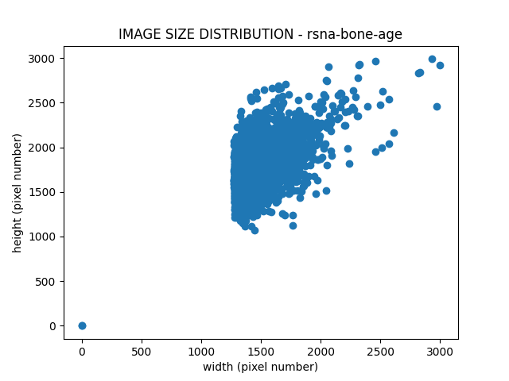
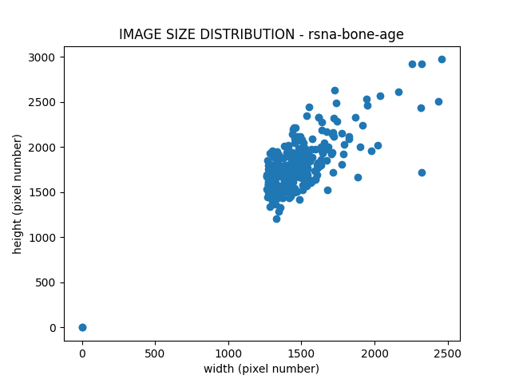
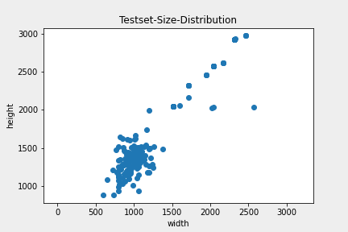
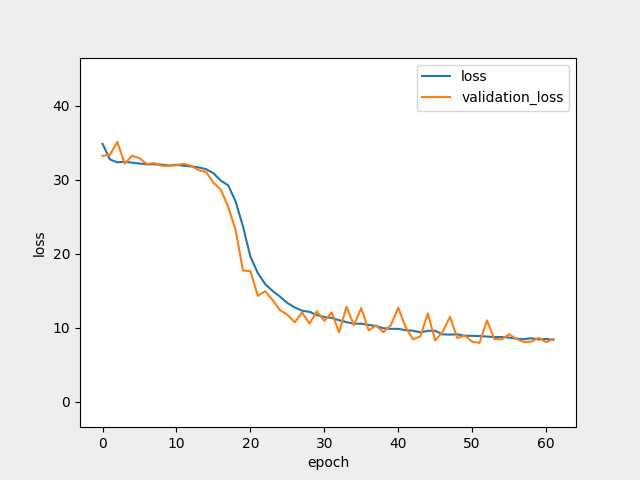

# BoneAge-Predict  

  

입력층으로 X-Ray 사진 파일(png)과 Gender(Boolean)를 받아서 뻐나이를 예측하는 딥러닝 모델  


## Dependencies

* pip install pandas
* pip install numpy
* pip install opencv-python
* pip install matplotlib
* pip install timm  
* pip install torchsummary
* pip install tensorboard
* pip3 install torch==1.9.0+cu111 torchvision==0.10.0+cu111 torchaudio===0.9.0 -fhttps://download.pytorch.org/whl/torch_stable.html  


## DataSet  

RSNA Pediatric Bone Age Challenge(2017)를 사용  
test dataset에 대한 GT(Label)는 여기서 얻을 수 있다. (https://github.com/neuro-inc/ml-recipe-bone-age)  

    # Train - 12611 images
    # Val   - 1425  images
    # Test  - 200   images 

bone_data의 test, train, validation 폴더에 각각의 image 파일을 넣어줘야 한다.  

dataset 각각의 image size는 다음과 같이 나온다. (제각각이다.)  

> train dataset size distribution  

  

> validation dataset size distribution  

  

> test dataset size distribution  

  


## loss  

loss: L1Loss(MAE)를 사용 
optimizer: Adam, 파라미터는 기본 값 그대로 사용  
lr_scheduler: ReduceLROnPlateau 사용  

   


## Accuracy (MAE)  

>MAE: 27.023 ->
 14.04613 -> 12.00912 -> 8.547 -> 7.829 -> 5.79605 -> 5.2375(month)  
개선중.. (4~6 MAE를 목표로)  


## To-do's ```~2021-09-20```  

- [ ] EfficientNet v2: Adaptive Regularization with Progressive Learning  
- [ ] Histogram 그려보고 데이터 적은쪽은 Augmentation으로 데이터 늘리는 쪽이 더 좋을지도?
