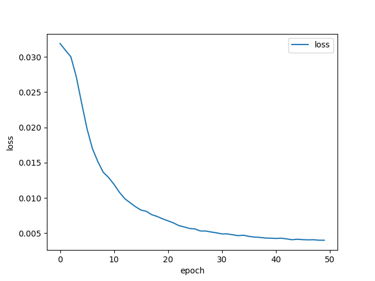
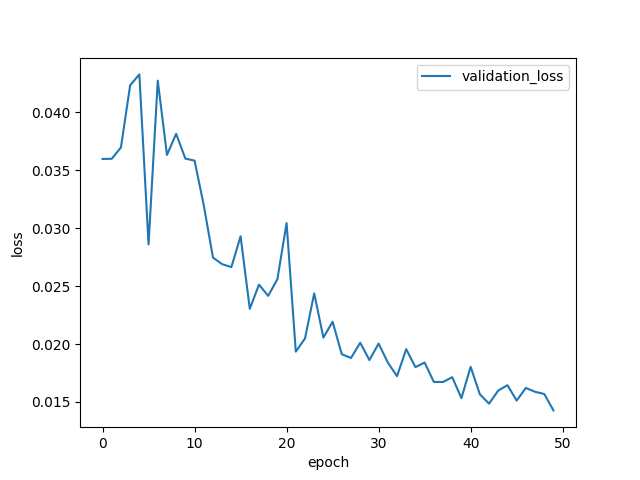

# BoneAge-Predict  

  

입력층으로 X-Ray 사진 파일(png)과 Gender(Boolean)를 받아서 뻐나이를 예측하는 딥러닝 모델  
## Dependencies

* pytorch 1.9.0
* pandas
* numpy
* glob
* open-cv
* matplotlib
* timm

## DataSet  

RSNA Pediatric Bone Age Challenge(2017)를 사용  
test set은 challenge라서 그런지 boneage에 대한 라벨링이 되어있지 않아서  
validation set을 2개로 나누어 측정했다.  

    # Train - 12611 images
    # Val   -  800 images
    # Test  -  625 images 

bone_data의 test, train, validation 폴더에 각각의 image 파일을 넣어줘야 한다.  

dataset 각각의 image size는 다음과 같이 나온다. (재각각이다.)  

> train dataset size distribution  

  

> validation dataset size distribution  

  

> test dataset size distribution  

  


## loss  

loss는 MSE loss를 사용했고 vlidation set데이터가 충분치 않아서 안정적이지 못하므로 개선해야 한다.  


  


## Accuracy (MAE)  

>MAE: 27.023 -> 14.04613 -> 12.00912 (month)  

개선중.. (4~6 MAE를 목표로)  


## To-do's ```2021-08-12~```  

- [ ] EfficientNet v2: Adaptive Regularization with Progressive Learning
- [ ] Gender, image data shuffle -> MixConv?
- [ ] Change Activation Function: EfficientNet v2에서는 swish(SiLU)를 사용하므로 전체적으로 SiLU로 통일해 보기
- [ ] Change Network Architecture 1: gender 맨 뒤에 넣기 or 앞에도 넣고 뒤에도 넣기
- [ ] Change Network Architecture 2: image와 gender를 먼저 concatenation 한 뒤 efficientNet에 넣어보기
- [ ] Change Network Architecture 3: Localization network 구현: 손을 식별하고 crop하여 비율이 뭉개지지 않도록
- [ ] CAM 혹은 Grad-CAM을 사용해서 heatMap 확인해보기 (gender와 concatenate 되는 구조 때문에 잘 될지 모르겠음)
- [ ] Age Normalization 제거해보기 -> 어떤 영향을 끼치는지 살펴보기
- [ ] 현재 사용중인 test / validation dataset과 train dataset에 차이가 있음 -> 16bit winner와 같은 구성으로 train 후 validation을 
