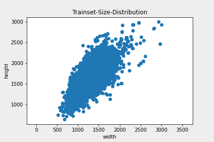
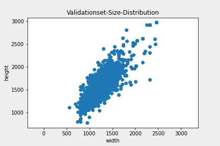

# BoneAge-Predict  

  

입력층으로 X-Ray 사진 파일(png)과 Gender(Boolean)를 받아서 뻐나이를 예측하는 딥러닝 모델  


## Dependencies

* pytorch 1.9.0  
* pandas  
* numpy  
* open-cv  
* matplotlib  
* timm  
* torchsummary  
* UniformAugment (git+https://github.com/tgilewicz/uniformaugment/)


## DataSet  

RSNA Pediatric Bone Age Challenge(2017)를 사용  
test dataset에 대한 GT(Label)는 여기서 얻을 수 있다. (https://github.com/neuro-inc/ml-recipe-bone-age)  

    # Train - 12611 images
    # Val   - 1425  images
    # Test  - 200   images 

bone_data의 test, train, validation 폴더에 각각의 image 파일을 넣어줘야 한다.  

dataset 각각의 image size는 다음과 같이 나온다. (재각각이다.)  

> train dataset size distribution  

  

> validation dataset size distribution  

  

> test dataset size distribution  

  


## loss  

loss: L1Loss(MAE)를 사용 
optimizer: Adam, 파라미터는 기본 값 그대로 사용  
lr_scheduler: ReduceLROnPlateau 사용  

   


## Accuracy (MAE)  

>MAE: 27.023 ->
 14.04613 -> 12.00912 -> 8.547 -> 7.829(month)  

MSELoss를 사용 시 MAE: 10.46805  
개선중.. (4~6 MAE를 목표로)  


## To-do's ```2021-08-26~```  

- [ ] EfficientNet v2: Adaptive Regularization with Progressive Learning  
- [ ] CAM 혹은 Grad-CAM을 사용해서 heatMap 확인해보기 (gender와 concatenate 되는 구조 때문에 잘 될지 모르겠음) 
- [ ] Loss를 MAE -> MSE로 변경 후 차이점 확인
- [x] Rand-Augment 혹은 Uniform-Augment 적용 (Rotation, translation, zoom up, flip.. etc)
- [ ] 이미지에 손상을 주지 않고 resize가 가능한 방법 모색 (FCN, image Padding, self-supervised learning(micle))

***  

- [ ] Change Network Architecture 1: gender 맨 뒤에 넣기 or 앞에도 넣고 뒤에도 넣기 - 보류  
- [ ] Change Network Architecture 2: image와 gender를 먼저 concatenation 한 뒤 efficientNet에 넣어보기 - 보류  
- [ ] Change Network Architecture 3: Localization network 구현: 손을 식별하고 crop하여 비율이 뭉개지지 않도록 - 보류  
- [ ] Gender, image data shuffle -> MixConv? - 보류  